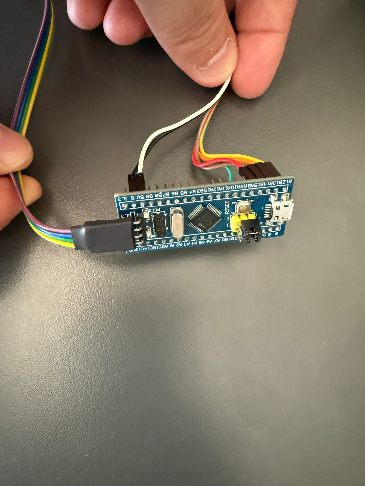
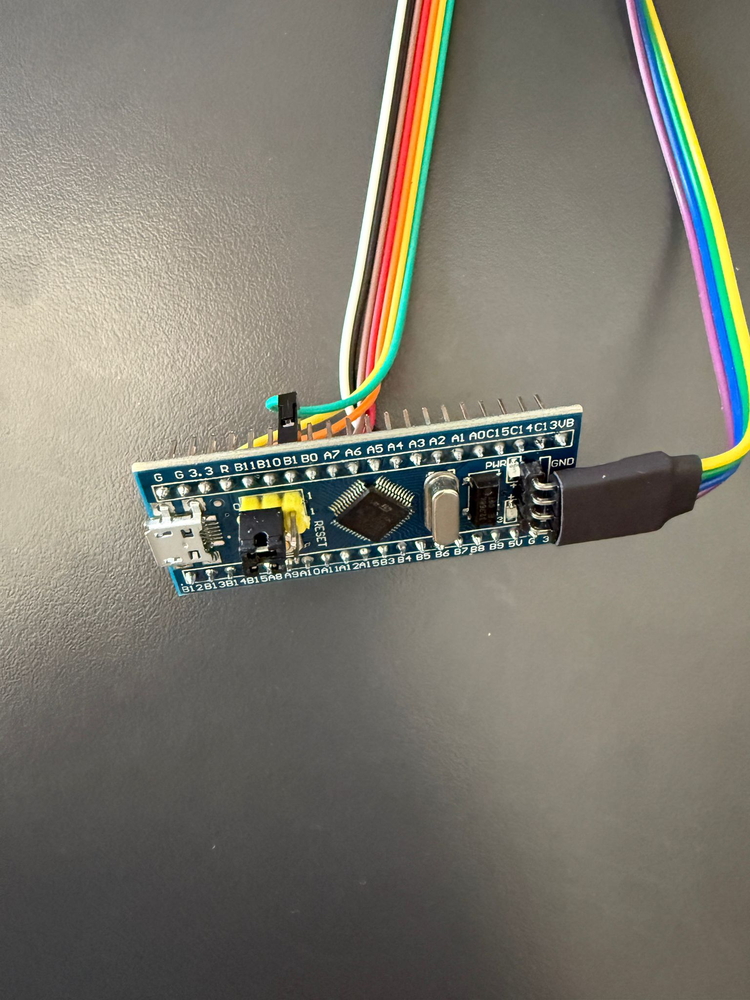
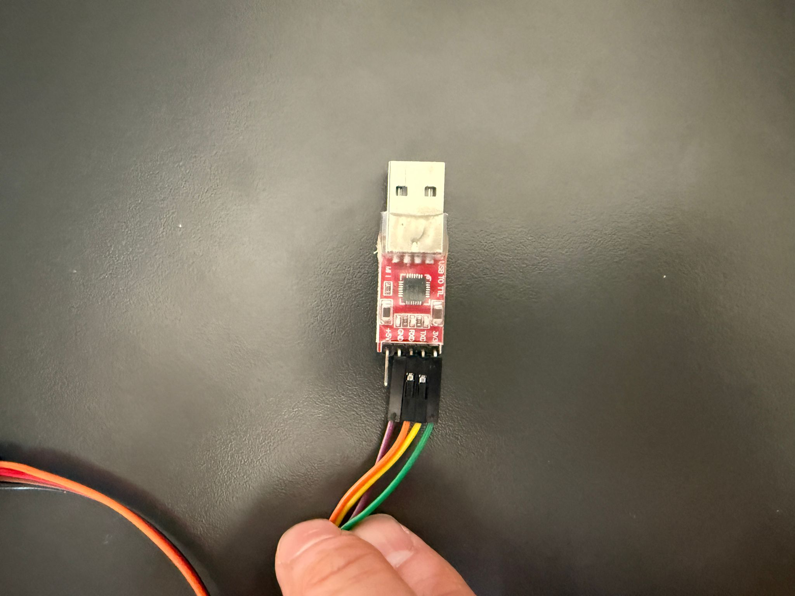
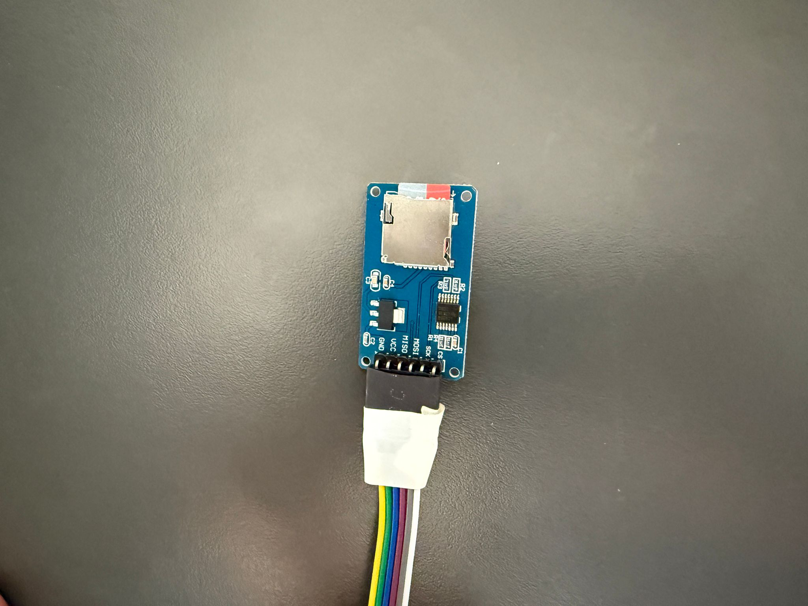

# STM32F103C8T6 ile Çift SD Kart Yönetimi

[English Version](README_EN.md)

## Proje Hakkında

Bu proje, STM32F103C8T6 mikrodenetleyicisi kullanarak aynı SPI hattı üzerinden iki farklı SD kartı yönetmeyi amaçlamaktadır. Bu yapı, veri yedekleme, log kayıtları veya farklı veri depolama ihtiyaçları için ideal bir çözüm sunmaktadır.

## Donanım Gereksinimleri

- STM32F103C8T6 (Blue Pill) mikrodenetleyici
- 2x Micro SD Kart Modülü
- 2x Micro SD Kart
- Bağlantı kabloları
- 3.3V güç kaynağı

## Devre Bağlantıları

### Devre Şeması
```
+------------------+          +------------------+
|                  |          |                  |
|   STM32F103C8T6  |          |    SD Card 1     |
|                  |          |                  |
|  PB15 (MOSI) ----+--------->+ MOSI            |
|                  |          |                  |
|  PB14 (MISO) <---+----------+ MISO            |
|                  |          |                  |
|  PB13 (SCK)  ----+--------->+ SCK             |
|                  |          |                  |
|  PB12 (CS1)  ----+--------->+ CS              |
|                  |          |                  |
|  PB2  (CS2)  ----+--------->+ CS              |
|                  |          |                  |
|  3.3V        ----+--------->+ VCC             |
|                  |          |                  |
|  GND         ----+--------->+ GND             |
|                  |          |                  |
+------------------+          +------------------+
                                     |
                                     |
                            +------------------+
                            |                  |
                            |    SD Card 2     |
                            |                  |
                            | MOSI            |
                            |                  |
                            | MISO            |
                            |                  |
                            | SCK             |
                            |                  |
                            | CS              |
                            |                  |
                            | VCC             |
                            |                  |
                            | GND             |
                            |                  |
                            +------------------+
```

### Gerçek Devre Görünümü


### SPI Bağlantıları
- MOSI: PB15
- MISO: PB14
- SCK: PB13
- CS1: PB12 (İlk SD Kart için)
- CS2: PB2 (İkinci SD Kart için)

### Güç Bağlantıları
- VCC: 3.3V
- GND: GND

## Yazılım Özellikleri

### STM32CubeIDE Konfigürasyonu







Proje, aşağıdaki temel özellikleri içermektedir:

1. **Çift SD Kart Desteği**
   - Aynı SPI hattı üzerinden iki farklı SD kart yönetimi
   - Her kart için ayrı CS (Chip Select) kontrolü

2. **Temel Dosya İşlemleri**
   - Dosya yazma
   - Dosya okuma
   - Dosya oluşturma
   - Dosya silme

3. **Örnek Uygulamalar**
   - Konfigürasyon dosyası yazma/okuma
   - Sensör verisi kaydetme
   - Log dosyası oluşturma
   - Sistem ayarları yönetimi

## Kod Örnekleri

### SD Kart Seçimi
```c
void SD_CS_Select(uint16_t cs_pin) {
    HAL_GPIO_WritePin(GPIOB, cs_pin, GPIO_PIN_RESET);
}

void SD_CS_Deselect(uint16_t cs_pin) {
    HAL_GPIO_WritePin(GPIOB, cs_pin, GPIO_PIN_SET);
}
```

### Dosya Yazma İşlemi
```c
void write_to_both_sd_cards(const char* filename, const char* data) {
    write_to_sd_card(filename, data, GPIO_PIN_12);  // SD Card 1
    write_to_sd_card(filename, data, GPIO_PIN_2);   // SD Card 2
}
```

## Kullanım Senaryoları

1. **Veri Yedekleme**
   - Önemli verilerin iki farklı SD karta yedeklenmesi
   - Otomatik yedekleme sistemi

2. **Log Kayıtları**
   - Sistem loglarının farklı kartlara kaydedilmesi
   - Hata ayıklama ve izleme

3. **Konfigürasyon Yönetimi**
   - Sistem ayarlarının yedekli saklanması
   - Ayarların senkronize tutulması

## Önemli Notlar

1. SPI hattı üzerinden iletişim kurarken CS pinlerinin doğru yönetilmesi kritik öneme sahiptir.
2. Her iki SD kartın da aynı SPI hattını kullanması nedeniyle, aynı anda sadece bir kart ile iletişim kurulabilir.
3. FATFS dosya sistemi kullanılarak standart dosya işlemleri gerçekleştirilmektedir.

## Geliştirme Ortamı

- STM32CubeIDE
- STM32CubeMX
- FATFS Middleware

## Gelecek Geliştirmeler

1. SD kart sağlık kontrolü
2. Otomatik hata düzeltme
3. Dosya senkronizasyon mekanizması
4. Güç kesintisi durumunda veri koruma

## Sonuç

Bu proje, STM32F103C8T6 mikrodenetleyicisi kullanarak tek bir SPI hattı üzerinden iki farklı SD kartı yönetmenin mümkün olduğunu göstermektedir. Bu yapı, veri yedekleme ve güvenliği için uygun bir çözüm sunmaktadır.

---

*Not: Bu proje STM32F103C8T6 mikrodenetleyicisi üzerinde test edilmiştir. Farklı mikrodenetleyicilerde kullanım için gerekli değişiklikler yapılmalıdır.* 

## Proje Görselleri


 