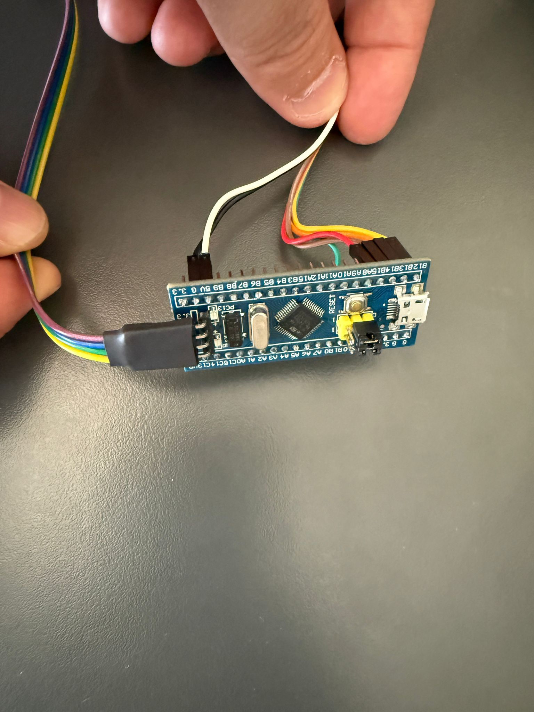
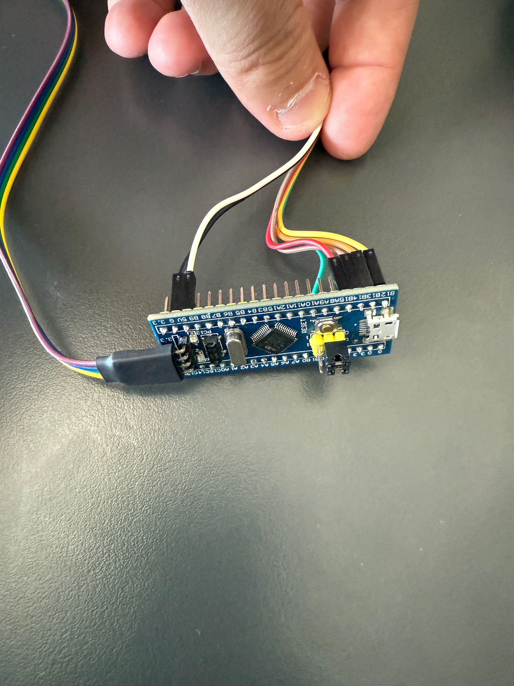
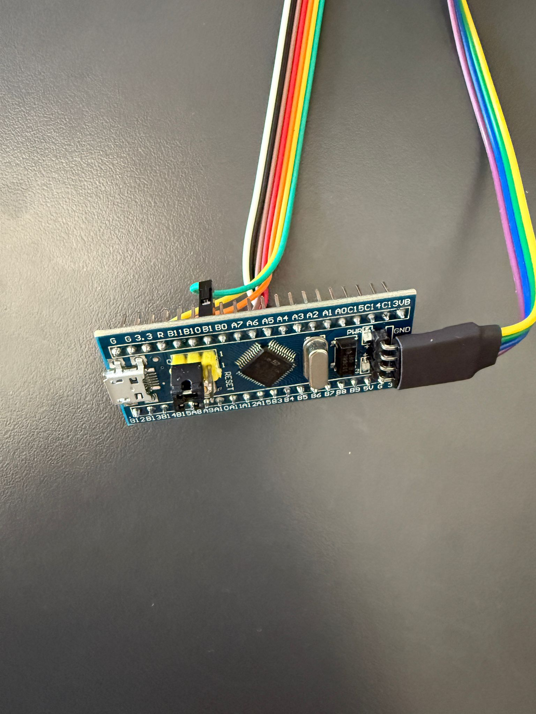
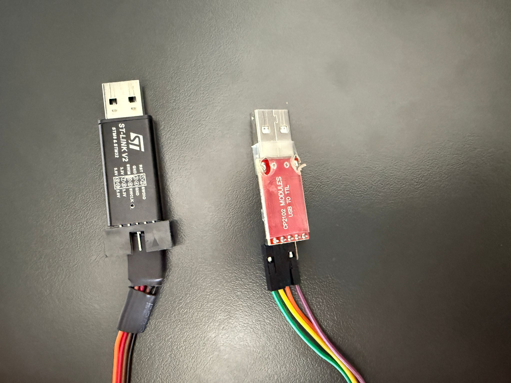
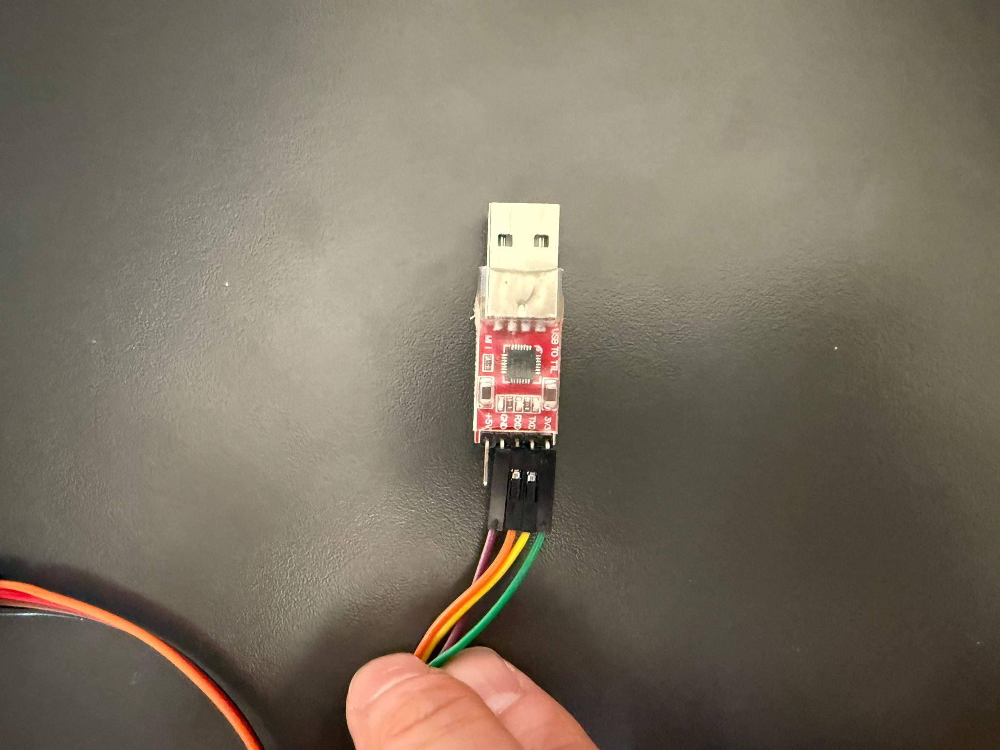
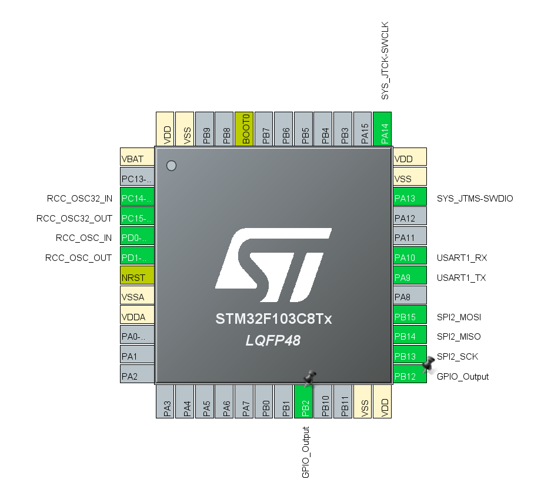

# Dual SD Card Management with STM32F103C8T6

## About the Project

This project aims to manage two different SD cards through the same SPI bus using the STM32F103C8T6 microcontroller. This structure provides an ideal solution for data backup, log records, or different data storage needs.

## Hardware Requirements

- STM32F103C8T6 (Blue Pill) microcontroller
- 2x Micro SD Card Module
- 2x Micro SD Card
- Connection cables
- 3.3V power supply

## Circuit Connections

### Circuit Diagram
```
+------------------+          +------------------+
|                  |          |                  |
|   STM32F103C8T6  |          |    SD Card 1     |
|                  |          |                  |
|  PB15 (MOSI) ----+--------->+ MOSI            |
|                  |          |                  |
|  PB14 (MISO) <---+----------+ MISO            |
|                  |          |                  |
|  PB13 (SCK)  ----+--------->+ SCK             |
|                  |          |                  |
|  PB12 (CS1)  ----+--------->+ CS              |
|                  |          |                  |
|  PB2  (CS2)  ----+--------->+ CS              |
|                  |          |                  |
|  3.3V        ----+--------->+ VCC             |
|                  |          |                  |
|  GND         ----+--------->+ GND             |
|                  |          |                  |
+------------------+          +------------------+
                                     |
                                     |
                            +------------------+
                            |                  |
                            |    SD Card 2     |
                            |                  |
                            | MOSI            |
                            |                  |
                            | MISO            |
                            |                  |
                            | SCK             |
                            |                  |
                            | CS              |
                            |                  |
                            | VCC             |
                            |                  |
                            | GND             |
                            |                  |
                            +------------------+
```

### Real Circuit View


### SPI Connections
- MOSI: PB15
- MISO: PB14
- SCK: PB13
- CS1: PB12 (For First SD Card)
- CS2: PB2 (For Second SD Card)

### Power Connections
- VCC: 3.3V
- GND: GND

## Software Features

### STM32CubeIDE Configuration


The project includes the following basic features:

1. **Dual SD Card Support**
   - Management of two different SD cards through the same SPI bus
   - Separate CS (Chip Select) control for each card

2. **Basic File Operations**
   - File writing
   - File reading
   - File creation
   - File deletion

3. **Example Applications**
   - Configuration file read/write
   - Sensor data storage
   - Log file creation
   - System settings management

## Code Examples

### SD Card Selection
```c
void SD_CS_Select(uint16_t cs_pin) {
    HAL_GPIO_WritePin(GPIOB, cs_pin, GPIO_PIN_RESET);
}

void SD_CS_Deselect(uint16_t cs_pin) {
    HAL_GPIO_WritePin(GPIOB, cs_pin, GPIO_PIN_SET);
}
```

### File Writing Operation
```c
void write_to_both_sd_cards(const char* filename, const char* data) {
    write_to_sd_card(filename, data, GPIO_PIN_12);  // SD Card 1
    write_to_sd_card(filename, data, GPIO_PIN_2);   // SD Card 2
}
```

## Use Cases

1. **Data Backup**
   - Backup of important data to two different SD cards
   - Automatic backup system

2. **Log Records**
   - Storage of system logs on different cards
   - Debugging and monitoring

3. **Configuration Management**
   - Redundant storage of system settings
   - Synchronized settings maintenance

## Important Notes

1. Proper management of CS pins is critical when communicating over the SPI bus.
2. Since both SD cards use the same SPI bus, only one card can communicate at a time.
3. Standard file operations are performed using the FATFS file system.

## Development Environment

- STM32CubeIDE
- STM32CubeMX
- FATFS Middleware

## Future Improvements

1. SD card health monitoring
2. Automatic error correction
3. File synchronization mechanism
4. Data protection during power interruption

## Conclusion

This project demonstrates that it is possible to manage two different SD cards through a single SPI bus using the STM32F103C8T6 microcontroller. This structure provides a suitable solution for data backup and security.

---

*Note: This project has been tested on the STM32F103C8T6 microcontroller. Necessary modifications should be made for use with different microcontrollers.*

## Project Images







 